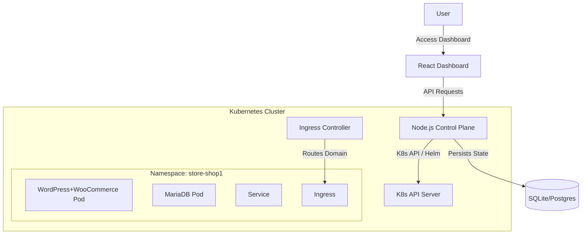

# Urumi Store Provisioning Platform

A Kubernetes-native platform for provisioning isolated e-commerce stores (WooCommerce) on demand.

## Features

- **Store Provisioning:** automated Deployment, Service, and Ingress creation.
- **Isolation:** Each store runs in its own Namespace with `NetworkPolicy`, `ResourceQuota`, and `LimitRange`.
- **Control Plane:** Node.js/TypeScript REST API with Audit Logging (SQLite).
- **Dashboard:** React + Vite + Tailwind CSS UI for managing stores.

## Architecture

See [SystemDesign.md](./SystemDesign.md) for detailed design decisions and tradeoffs.



- **Backend:** Node.js (Express, Sequelize, @kubernetes/client-node).
- **Frontend:** React (Vite, Tailwind).
- **Infrastructure:** Helm Charts (Universal Store Chart using Bitnami WordPress/MariaDB).

## System Design Daigram


## Prerequisites

- Node.js v18+ (tested on v18.19.1)
- Docker
- Kubernetes Cluster (Kind or Minikube)
- Helm v3+
- Kubectl

## Getting Started

### 1. Setup Cluster

```bash
kind create cluster --name urumi
# Install Nginx Ingress (Required for Ingress resources)
kubectl apply -f https://raw.githubusercontent.com/kubernetes/ingress-nginx/main/deploy/static/provider/kind/deploy.yaml

# IMPORTANT: Port-forward Ingress Controller to access stores
# Keep this running in a separate terminal
kubectl port-forward -n ingress-nginx service/ingress-nginx-controller 8081:80
```

### 2. Backend Setup

```bash
cd backend
npm install
# Set NODE_ENV to 'local' (default) or 'production'
export NODE_ENV=local
npm start
# Server runs on http://localhost:3000
```

### 3. Frontend Setup

```bash
cd frontend
npm install
npm run dev
# Dashboard runs on http://localhost:5173
```

### 4. Create a Store

1. Open http://localhost:5173
2. Click "New Store"
3. Enter Name (e.g. "My Shop") and Subdomain (e.g. "shop1").
4. Wait for status to change from "Provisioning" to "Ready".
5. Access store at `http://shop1.localhost:8081`.
   - **Note:** Ensure you have `.localhost` domains mapping to `127.0.0.1` in your `/etc/hosts` if your system doesn't do this automatically.
   - **Note:** The "Visit" button relies on the port-forward (8081) running.

### 5. Place an Order

1.  **Access Admin Panel**:
    - Go to `http://shop1.localhost:8081/wp-admin` (replace `shop1` with your subdomain).
    - Login with verified credentials (default: `user` / `bitnami`).
2.  **Add a Product**:
    - Navigate to **Products > Add New**.
    - Enter a name (e.g., "T-Shirt"), set a price (e.g., "$20"), and click **Publish**.
3.  **Visit Store**:
    - Go to `http://shop1.localhost:8081`.
    - You should see your new product.
4.  **Checkout**:
    - Add product to cart.
    - Proceed to checkout.
    - Fill in details. Note: You may need to enable "Cash on Delivery" or "Check Payments" in **WooCommerce > Settings > Payments** if not already enabled.
    - Click **Place Order**.
5.  **Verify**:
    - Go back to `/wp-admin` > **WooCommerce > Orders**.
    - You should see the new order.

## Production Deployment (VPS/k3s)

To deploy this platform on a production VPS (e.g., DigitalOcean, AWS, Linode) running k3s:

1.  **Install k3s**:

    ```bash
    curl -sfL https://get.k3s.io | sh -
    ```

2.  **Configure Environment**:
    - Ensure `kubectl` is configured (`/etc/rancher/k3s/k3s.yaml`).
    - Set `NODE_ENV=production` for the backend.
    - Update `charts/woocommerce-store/values-prod.yaml` with your real domain and storage class.

3.  **Run Backend/Frontend**:
    - Build Docker images and deploy them to the cluster (or run via PM2/systemd on the host).

4.  **Ingress & DNS**:
    - Point your domain (e.g., `*.example.com`) to the VPS IP.
    - The `values-prod.yaml` should configure Ingress to use your domain instead of `.localhost`.

## Standout Features

- **Namespace Isolation:** Stores are isolated at K8s level.
- **Resource Quotas:** CPU/Memory limits forced per tenant.
- **Network Policies:** Cross-tenant traffic blocked.
- **Audit Logging:** All actions recorded in SQLite `audit_logs` table.

## Development

- **Backend:** `src/server.ts`
- **Frontend:** `src/App.tsx`
- **Charts:** `charts/woocommerce-store`
