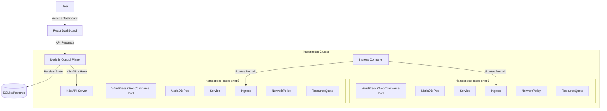

# System Design: Urumi Store Provisioning Platform

## 1. Overview

The **Urumi Store Provisioning Platform** allows dynamic, on-demand creation of isolated e-commerce environments (Woocommerce stores) on a Kubernetes cluster. It provides a centralized control plane for managing the lifecycle of these stores (Create, List, Delete) while enforcing strict multi-tenant isolation.

## 2. Architecture

### 2.1 High-Level Diagram

### 2.2 Components

#### Frontend (Control Plane Dashboard)

- **Tech Stack:** React, Vite, Tailwind CSS.
- **Function:** UI for users to view their stores and provision new ones.
- **Communication:** Polls the Backend API for status updates.

#### Backend (Control Plane API)

- **Tech Stack:** Node.js, Express, Sequelize, @kubernetes/client-node.
- **Responsibilities:**
  - **State Management:** Tracks store metadata (name, subdomain, status) in a relational database.
  - **Orchestration:** Calls Kubernetes API to create Namespaces and apply policies.
  - **Provisioning:** Executes Helm commands (or uses Helm SDK) to deploy the WooCommerce stack.
  - **Audit Logging:** Records all lifecycle events (Create/Delete) for compliance.

#### Infrastructure (Kubernetes)

- **Isolation Strategy:** Hard multi-tenancy using Namespaces.
- **Resource Management:** `ResourceQuota` limits CPU/Memory per tenant. `LimitRange` sets default container sizes.
- **Network Security:** `NetworkPolicy` explicitly denies all ingress traffic from other namespaces, allowing only traffic from the Ingress Controller and intra-namespace communication.

## 3. Data Flow

### 3.1 Provisioning Flow

1. **Request:** User submits "Create Store" (Name: "My Shop", Subdomain: "shop1").
2. **Validation:** Backend checks if "shop1" is unique in DB.
3. **Record:** Backend creates a `Store` record with status `Provisioning`.
4. **Step 1 - Namespace:** Backend creates `Namespace: store-shop1`.
5. **Step 2 - Policies:** Backend applies `ResourceQuota`, `LimitRange`, and `NetworkPolicy` to the namespace.
6. **Step 3 - Deploy:** Backend triggers Helm install of `woocommerce-store` chart.
7. **Polling:** Frontend polls API. Backend checks K8s Pod status.
8. **Completion:** When Pods run, Backend updates DB status to `Ready`. Frontend shows "Visit" link.

## 4. Security & Scalability

### Security

- **Isolation:** Critical. Each store is unaware of others.
- **Minimal Privilege:** The Backend ServiceAccount should only have permission to manage specific namespaces (in a real prod setup).
- **Audit:** All actions are logged.

### Scalability

- **Horizontal Scaling:** The stateless Backend can be scaled. The Database can be migrated to managed Postgres.
- **Cluster Autobcaling:** Kubernetes Cluster Autoscaler will add nodes as new Stores claim resources.

## 5. Future Improvements

- **Authentication:** Add User Auth (Auth0/Cognito) to Control Plane.
- **Monitoring:** Prometheus/Grafana integration for per-tenant metrics.
- **Billing:** Integrate Stripe based on active store time.

## 6. Design Decisions & Tradeoffs

### Architecture Choice: Kubernetes Native

- **Why?** We chose a Kubernetes-native approach (using Namespaces for tenancy) over a traditional VM-based approach or a shared-database approach.
- **Pros:**
  - **Strong Isolation:** Each store gets its own Namespace, effectively isolating resources and networking.
  - **Scalability:** Leveraging K8s `Deployment` and `Service` primitives allows us to scale stores independently.
  - **Standardization:** Using Helm charts ensures every store is deployed with the exact same configuration.
- **Cons:**
  - **Complexity:** Higher initial setup complexity compared to a monolith.
  - **Resource Overhead:** Each store running its own Pods (WP + DB) consumes more inherent cluster resources than a shared-hosting model.

### Idempotency & Failure Handling

- **Idempotency:** The backend checks for the existence of a Store record (and underlying K8s resources) before attempting creation. If a user retries a creation request for "shop1", the system detects it already exists and returns the existing status rather than failing or duplicating.
- **Failure Handling:**
  - **Helm Atomicity:** We rely on Helm's atomic operations. If a chart installation fails, Helm rolls back the release.
  - **Status Polling:** The frontend polls for status updates. If the backend detects a K8s deployment failure (e.g., `ImagePullBackOff`), it can update the store status to `Error` (future improvement to surface this to UI).
- **Cleanup:** Deleting a store triggers a cascading delete of the Namespace, which automatically cleans up all resources (PVCs, Services, Secrets) contained within it.

### Production Considerations

To move this system to production (e.g., on AWS EKS or DigitalOcean K8s), the following changes are required:

1.  **Ingress & DNS:** Replace `.localhost` routing with a wildcard DNS record (e.g., `*.shops.example.com`) pointing to the Ingress Controller's LoadBalancer IP.
2.  **StorageClass:** Replace the default `standard` (or `local-path` in Kind) StorageClass with a production-grade provider (e.g., `gp2`/`gp3` on AWS, `do-block-storage` on DigitalOcean) to ensure persistent data durability.
3.  **Secrets Management:** Move sensitive DB passwords from plain text Helm values to a Secret management solution (like HashiCorp Vault or AWS Secrets Manager) or at least use sealed-secrets.
4.  **Database:** For high availability, verify the MariaDB helm chart is configured for replication, or use a managed database service (RDS/CloudSQL) for the store databases (requires chart modification).
